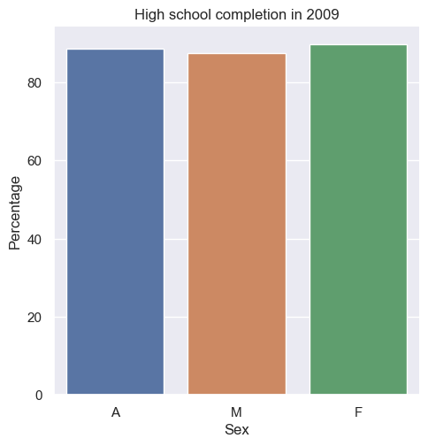
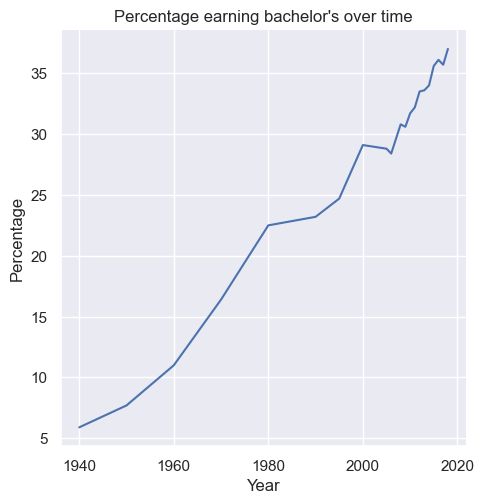

# Education Data Analysis (Python)
In this project, I analyzed trends in U.S. educational attainment using Python.
The goal was to explore how the percentage of people achieving different education
levels has changed over time and how these trends vary across demographic groups.

I worked with a dataset from the National Center for Education Statistics (NCES).
I used Python libraries such as pandas and seaborn to process the data and create 
visualizations that highlight these trends.

## Project Overview
The analysis focuses on examining educational attainment across multiple years
and comparing outcomes across different demographic groups. I implemented functions
to clean and process the dataset, compute statistics, and generate visualizations that 
make the trends easier to interpret.

The visualizations include:
- A line plot showing how the percentage of people earning a specific degree has changed over time.
- A bar chart comparing high school completion rates across different groups in a selected year.

These visualizations help illustrate how educational attainment has evolved 
and allow for easy comparison between groups.

## Tools and Technologies
- Python  
- pandas  
- seaborn  
- matplotlib  

## Repository Structure
- `hw3.py` – main script containing the data analysis and visualization functions  
- `nces-ed-attainment.csv` – dataset used for the analysis  
- `line_plot_min_degree.png` – line chart showing education attainment trends over time  
- `bar_plot_high_school.png` – bar chart comparing high school completion rates  

## Key Takeaways
This project strengthened my experience working with real-world datasets, 
cleaning and structuring data, and communicating insights through visualizations.
It also reinforced the importance of using clear visual representations to make complex 
data easier to understand.

## Visualizations
### High School Attainment Over Time

### Minimum Degree Attainment Over Time

